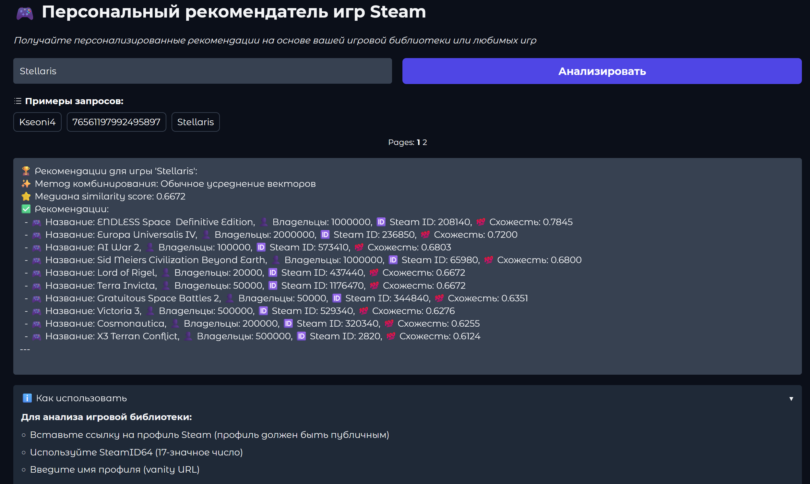

# Персональный рекомендатель игр Steam 🎮



## Описание проекта

Этот проект представляет собой систему для анализа данных об играх в Steam и предоставления персонализированных рекомендаций пользователям. Он использует комбинацию методов машинного обучения, обработки естественного языка и анализа данных.

Система анализирует описания и теги игр, чтобы найти похожие на них, и предоставляет пользователю список рекомендованных игр на основе его игровой истории или выбранной игры. Проект начинается со сбора данных из различных источников, включая API Steam, SteamSpy и наборы данных с Kaggle. Эти данные затем обрабатываются, очищаются и преобразуются в векторные представления, чтобы их можно было анализировать.

**Ключевые особенности проекта:**

*   **Уникальные рекомендации:** Генерация рекомендаций на основе множества факторов, открывающих возможности найти 💎hidden gem💎.
*   **Анализ описаний и тегов:** Поиск похожих игр на основе анализа текстовых описаний и тегов.
*   **Интерактивный веб-интерфейс:** Простой и удобный веб-интерфейс на Gradio.
*   **Оптимизация модели:** Использование тематического моделирования (NMF или LDA), косинусной схожести и квази-метрик для выбора наилучших параметров модели.

## Порядок запуска

Для запуска проекта после клонирования необходимо выполнить следующие шаги:

1.  **Установка NVIDIA Toolkit (рекомендуется)**

2.  **Настройка переменных окружения:**
    *   Создайте файл `.env` в корне проекта и заполните его необходимыми переменными окружения (например, STEAM\_API\_KEY, STEAM\_USER\_URL).
    *   Пример `.env`:
      
      ```env
        ### STEAM
        # Steam Web API key - Получите свой ключ на https://steamcommunity.com/dev/apikey
        STEAM_API_KEY="YOUR_STEAM_API_KEY"

        # Test Steam user ID - Числовой ID пользователя Steam для тестов
        STEAM_USER_ID="YOUR_STEAM_USER_ID"

        # Test Steam user vanity URL -  Имя пользователя Steam (vanity URL) для тестов
        STEAM_USER_URL="YOUR_STEAM_USER_URL"


        ### DATASET
        # Kaggle API key - Получите свой ключ на https://www.kaggle.com/me/api
        KAGGLE_API_KEY="YOUR_KAGGLE_API_KEY"
    ```

3.  **Запуск с помощью Docker Compose (рекомендуется):**

    *   Убедитесь, что Docker и Docker Compose установлены на вашем компьютере.
    *   Выполните команду для сборки и запуска контейнера:
        ```bash
        docker-compose up --build
        ```
    *   После запуска, перейдите по адресу в браузере `http://localhost:8888` для доступа к Jupyter Notebook, а для доступа к веб-интерфейсу Gradio, перейдите по адресу `http://localhost:7860` (убедитесь, что порт не занят).
    *   Для подключения по ssh используйте порт `2222`.
 
4.  **Запуск без Docker (альтернативный вариант):**

    *   Создайте виртуальное окружение (рекомендуется):
        ```bash
        python3 -m venv venv
        source venv/bin/activate  # Linux/macOS
        # venv\Scripts\activate # Windows
        ```
    *   Установите зависимости:
        ```bash
        pip install -r requirements.txt
        ```
     *  Запустите веб-интерфейс Gradio:
        ```bash
        cd src/web
        python3 gradio_demo.py
        ```
    *   Откройте в браузере ссылку, которая будет выведена в консоли.
      
5. **Обновление модели**
  *   Для обновления обученной модели используйте jupyter notebook `/notebooks/features_vectorization/model_learning.ipynb`, где производятся различные тесты и поиск параметров для модели.
  *   После завершения notebook, финальная обученная модель сохранится по пути `/src/models/latest_model_approved.pkl`

**Описание Docker and Devcontainer Setup** <a name="docker-and-devcontainer-setup"></a>

*   Используется `docker-compose.yml` и `Dockerfile` для создания окружения проекта, что позволяет работать с gpu.
*  Файл `devcontainer.json` нужен для настройки окружения для VS Code, включая необходимые расширения и параметры.
*  Используется NVIDIA Docker для работы с GPU.
*   Используется SSH (порт 2222) для подключения к контейнеру.
*   Образ включает в себя:
    *   Python 3.10 и все зависимости проекта, указанные в `requirements.txt`.
    *   CUDA 11.8 и RAPIDS (cuml) библиотеки для ускорения вычислений на GPU.
    *   Установленные `jupyter`, `nodejs`, `npm`, etc.

## Документация

Для получения детальной информации о всех компонентах проекта, перейдите на [вики проекта](https://github.com/TravUdav/Steam-Games-Recommender/wiki).

## Лицензия

Проект распространяется под лицензией MIT.
